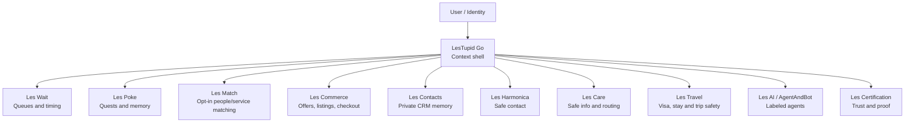
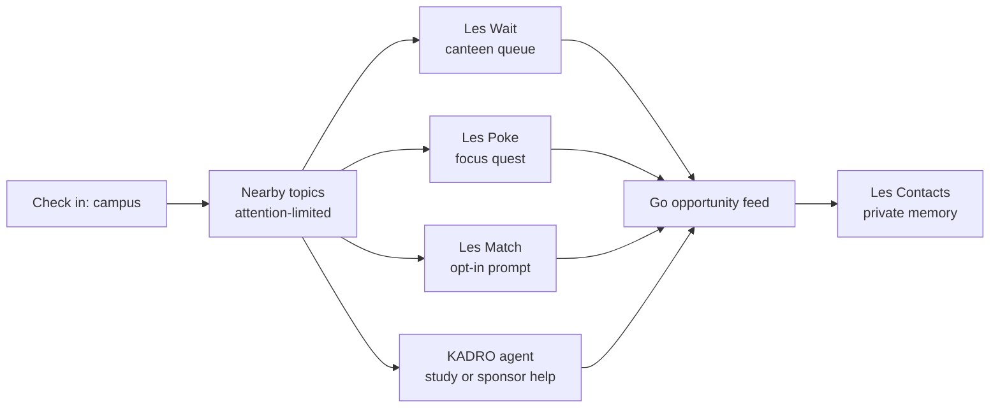
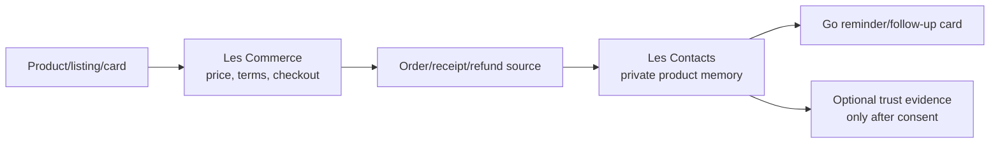
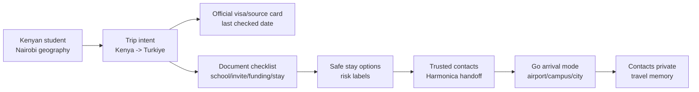
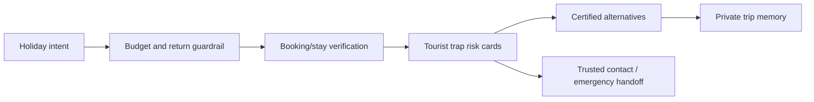
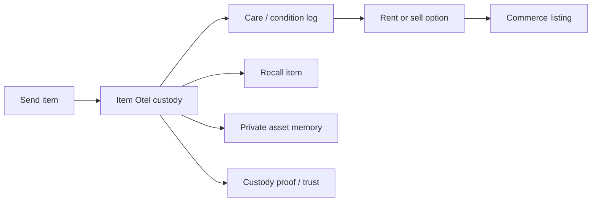
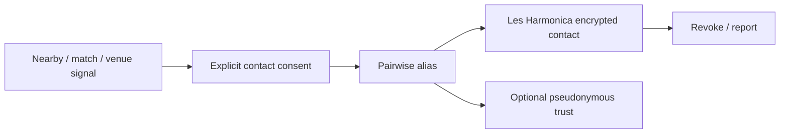
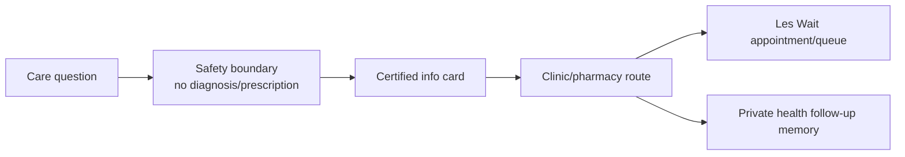

# LesTupid Visual Demo Flows

This document is the visual demo brief for humans and AI agents. Every app can
have its own screen, but the first shared visual layer is LesTupid Go:
`les_go` shows the ecosystem as contextual flows.

## Visual Rule

Fast things feel fast. Flowing things flow. Static things stand still. Crowded
places feel dense. Calm places breathe. Risky things look risky. Every product
keeps its own mood.

## Ecosystem Map

## Campus Day

## Commerce And Product Memory

## Kenya Student To Turkiye

## Holiday Risk Guard

## Item Otel

## Safe Contact

## Care And Safety

## Demo Surfaces

| Surface | What To Show | File |
| --- | --- | --- |
| Visual Flow Gallery | Cross-app storyboard cards | `les_go/src/main.tsx` |
| Go Hub | Place, mode, nearby topics, feed cards | `les_go/src/main.tsx` |
| Les Wait | Queue ticket and arrival window | `les_go/src/main.tsx`, `les_wait/waiting.html` |
| Les Poke | Quest map and XP | `les_go/src/main.tsx`, `Les_poke/apps/mobile/App.tsx` |
| Les Match | Opt-in profiles and chat handoff | `les_go/src/main.tsx` |
| Item Otel | Storage, care, listing and recall | `les_go/src/main.tsx` |
| Les Contacts | CRM timeline and context spaces | `les_go/src/main.tsx`, `les_contacts/README.md` |
| Les Harmonica | Proximity, alias, secure contact | `les_go/src/main.tsx` |
| Les AI | KADRO agent console | `les_go/src/main.tsx` |
| Certification | Selective trust and ZKP mock | `les_go/src/main.tsx` |
